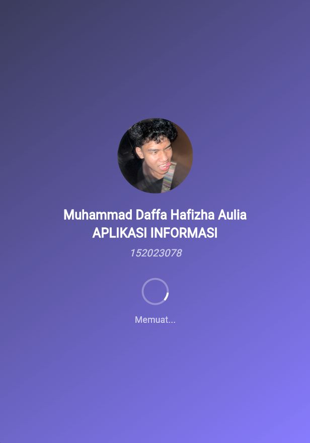
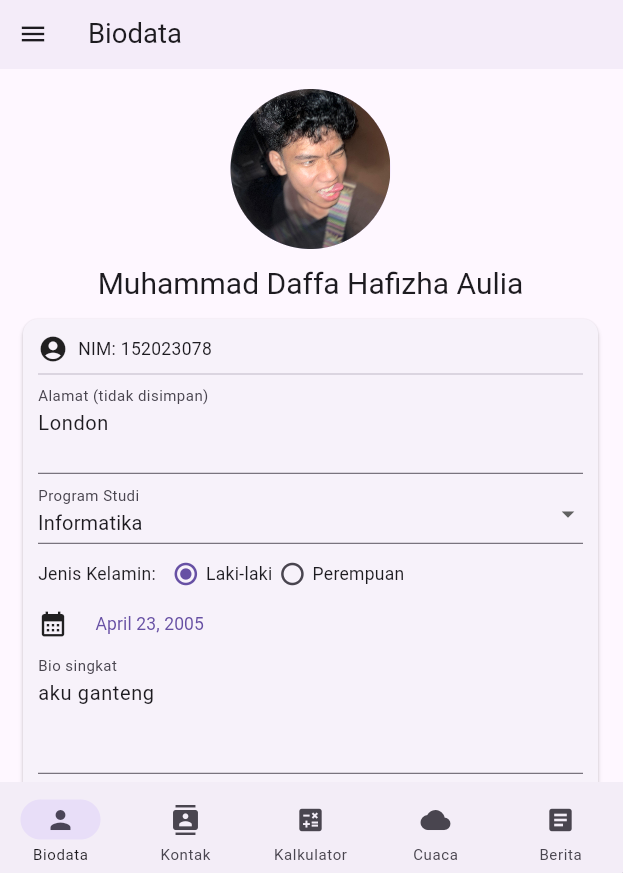
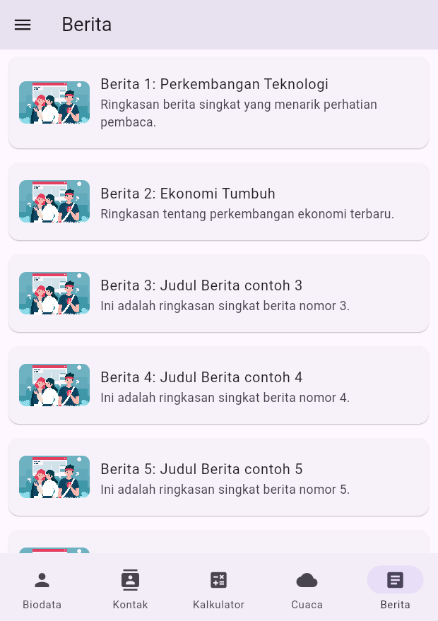
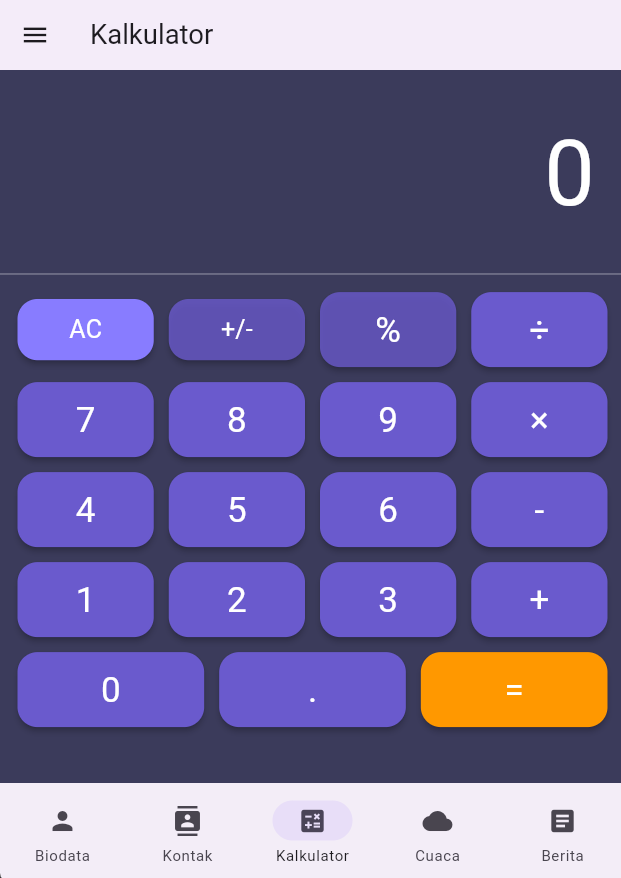
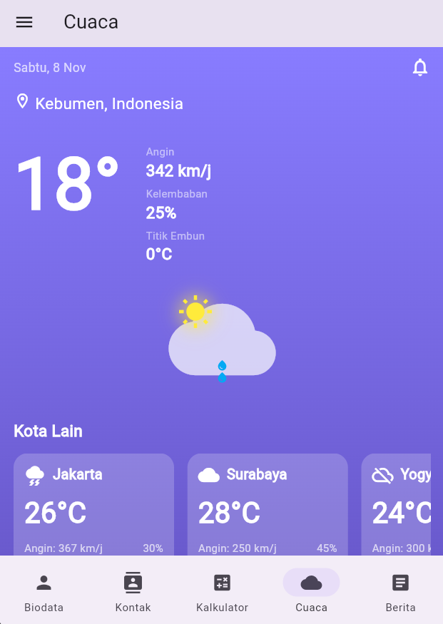
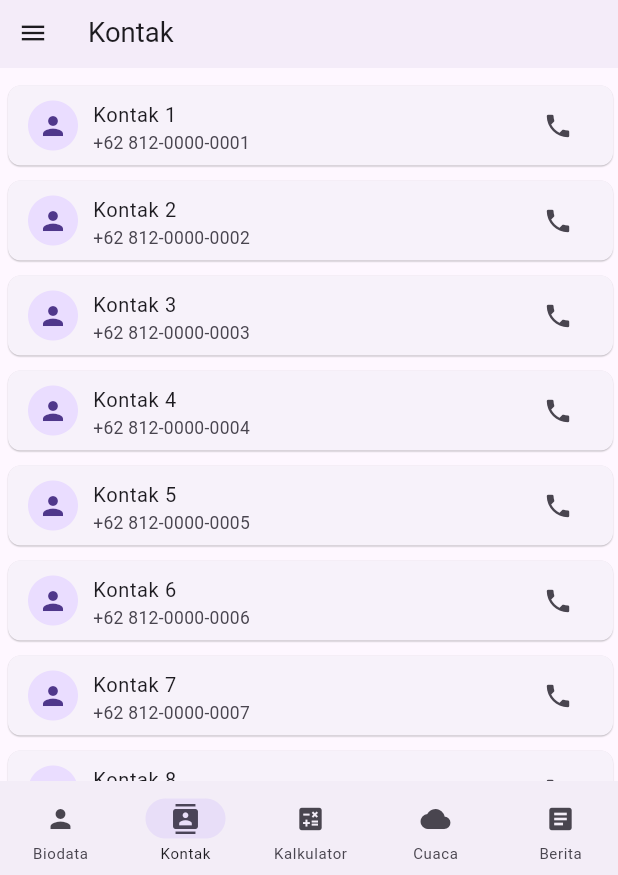

# 📱 utspemrogramanmobile

A new Flutter project for the Mobile Programming final test.

## 🖼️ Tampilan Aplikasi (Screenshots)

Berikut adalah beberapa tangkapan layar (screenshot) dari aplikasi ini:

| Tampilan 1 | Tampilan 2 | Tampilan 3 |
| :---: | :---: | :---: |
|  |  |  |

| Tampilan 4 | Tampilan 5 | Tampilan 6 |
| :---: | :---: | :---: |
|  |  |  |

---

## Getting Started

This project is a starting point for a Flutter application.

A few resources to get you started if this is your first Flutter project:

- [Lab: Write your first Flutter app](https://docs.flutter.dev/get-started/codelab)
- [Cookbook: Useful Flutter samples](https://docs.flutter.dev/cookbook)

For help getting started with Flutter development, view the
[online documentation](https://docs.flutter.dev/), which offers tutorials,
samples, guidance on mobile development, and a full API reference.